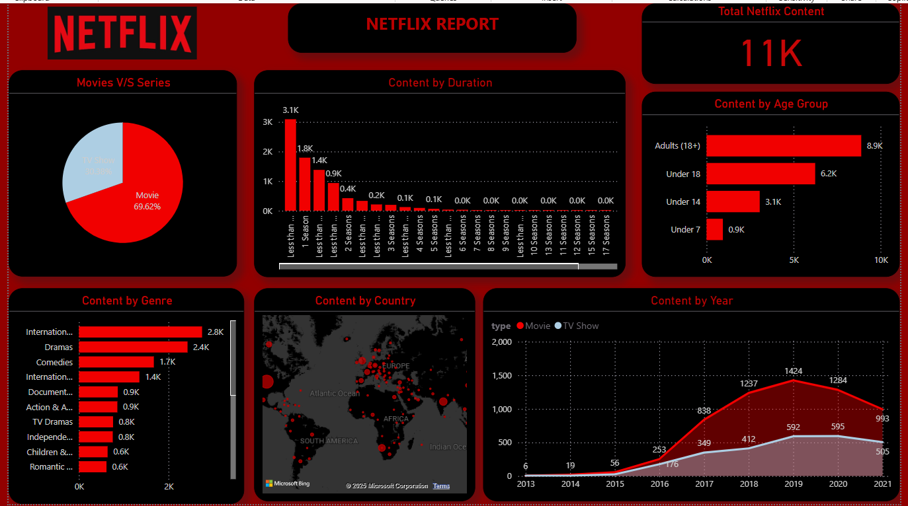

# Netflix Content Analysis Dashboard  

Welcome to my Netflix Content Analysis Dashboard project, created using Power BI. This project explores Netflix's extensive content library, providing insights into content distribution, genre trends, and audience demographics.  

---

## Project Overview  
In this analysis, I transformed raw Netflix data into meaningful visualizations, allowing users to explore content categories, duration trends, and geographical distribution. This dashboard highlights key insights into Netflix’s streaming content.  

---

## Key Insights  
The dashboard provides various analytical perspectives, including:  

- Movies vs. TV Shows: Breakdown of Netflix’s content types.  
- Content Duration: Distribution of content based on duration and seasons.  
- Genre Popularity: Identify the most common genres on Netflix.  
- Content by Country: Explore the global distribution of Netflix’s library.  
- Age Group Classification: Analyze content availability across different age groups.  
- Content Trends Over the Years: Track how Netflix's content library has evolved over time.  

---

## Tools & Technologies  
- Power BI – For data visualization and dashboard creation.  
- Data Cleaning & Transformation – Conducted within Power BI using Power Query.  

---

## Dataset  
The dataset used in this project was sourced from Netflix’s public content data, including information on movies, TV shows, genres, release years, and audience classifications.  

---

## How to Use This Dashboard  
1. Download the  file from the repository.  
2. Open it using Power BI Desktop.  
3. Interact with slicers and filters to explore different dimensions of the data.  

---

## Dashboard Preview  

